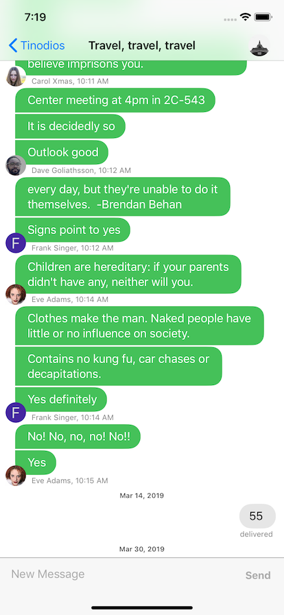
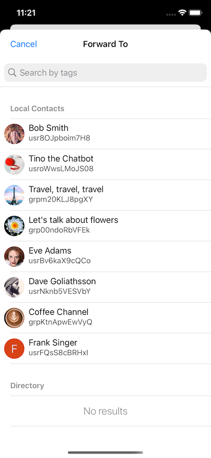

# Tinodios: Tinode Messaging Client for iOS

iOS client for [Tinode](https://github.com/tinode/chat) in Swift.

Status: beta. Usable and mostly stable but bugs may happen.

<a href="https://apps.apple.com/us/app/tinode/id1483763538"></a>

## Installing and running

Tinodios is NOT a standalone app. It's a frontend, a client. It requires a [backend](https://github.com/tinode/chat/). See [installation instructions](https://github.com/tinode/chat/blob/master/INSTALL.md).

**Important!** Due to Microsoft's (GitHub owner) policy of requiring developers of open source projects to [pay for for hosting large files on GitHub](https://docs.github.com/en/billing/managing-billing-for-git-large-file-storage/about-billing-for-git-large-file-storage#purchasing-additional-storage-and-bandwidth), this repository cannot include prebuilt binaries for `MobileVLCKit` and `WebRTC-lib`. As a consequence, we do not include Pod files into repository. You need to install them manually:
```
pod install
```
or on Apple Silicon (M1):
```
arch -x86_64 pod install
```

## Helping out

* If you appreciate our work, please help spread the word! Sharing on Reddit, HN, and other communities helps more than you think.
* Consider buying paid support: https://tinode.co/support.html
* If you are a software developer, send us your pull requests with bug fixes and new features.
* Become a beta-tester: try new features first and help us discover and fix problems. Send us a message _Add me to TestFlight_ at `testflight @ tinode . co` and we will add you to [TestFlight](https://developer.apple.com/testflight/).
* If you use the app and discover bugs or missing features, let us know by filing bug reports and feature requests. Vote for existing feature requests you find most valuable.
* If you speak a language other than English, [translate](https://github.com/tinode/chat/blob/devel/docs/translations.md#ios) the apps into your language. You may also review and improve existing translations.
* If you are a UI/UX expert, help us polish the app UI.
* Use it: install it for your colleagues or friends at work or at home.

## Getting support

* Read [server-side](https://github.com/tinode/chat/blob/master/docs/API.md) API documentation.
* For support, general questions, discussions post to [https://groups.google.com/d/forum/tinode](https://groups.google.com/d/forum/tinode).
* For bugs and feature requests [open an issue](https://github.com/tinode/ios/issues/new).
* Use https://tinode.co/contact for commercial inquiries.

## Features

### Completed

* One-on-one conversations and group chats.
* Video or audio calling.
* Channels with unlimited number of read-only subscribers.
* Unread message counters.
* Push notifications and in-app presence notifications.
* Message status notifications: message delivery to server; received and read notifications.
* Markdown-style formatting of text, e.g. \*style\* → **style**.
* Replying and forwarding messages.
* Trusted account badges: verified account, staff, etc.
* Form messages suitable for chatbots.
* Attachments and inline images, voice/audio messages.
* Muting/un-muting conversations and other granular permission management.
* Integration with iOS's stock Contacts.
* Invite contacts to the app by SMS or email.
* Transport Level Security - https/wss.
* Offline mode.

### Not Done Yet

* Previews not generated for videos, links or docs.
* No video messages.
* No typing indicators.
* No support for switching between multiple backends.
* No mentions, hashtags.
* End-to-End encryption is not implemented.

## Dependencies

* Google Firebase for [push notifications](https://firebase.google.com/docs/cloud-messaging/ios/client), [analytics](https://firebase.google.com/docs/analytics/get-started?platform=ios), and [crash reporting](https://firebase.google.com/docs/crashlytics/get-started?platform=ios). See below.
* [Kingfisher](https://github.com/onevcat/Kingfisher) for out-of-band image handling.
* [MobileVLCKit](https://code.videolan.org/videolan/VLCKit) for voice messages.
* [PhoneNumberKit](https://github.com/marmelroy/PhoneNumberKit) for normalizing phone numbers.
* [SQLite.swift](https://github.com/stephencelis/SQLite.swift) for convenience of SQLite use.
* [SwiftKeychainWrapper](https://github.com/jrendel/SwiftKeychainWrapper) for convenience of Keychain access.
* [WebRTC](https://github.com/stasel/WebRTC) for video and audio calls.


## Push notifications

If you want to use the app with your own server and want push notification to work you have to set them up:

* Register at https://firebase.google.com/, [set up the project](https://firebase.google.com/docs/ios/setup) if you have not done so already.
* [Download your own](https://firebase.google.com/docs/cloud-messaging/ios/client) config file `GoogleService-Info.plist` and place it in the `Tinodios/` folder of your copy of the project. The config file contains keys specific to your Firebase/FCM registration.
* Copy Google-provided server key to `tinode.conf`, see details [here](https://github.com/tinode/chat/blob/master/docs/faq.md#q-what-are-the-options-for-enabling-push-notifications).

## Translations

The app is currently available in the following languages:
* English (default)
* Chinese (simplified)
* Chinese (traditional)
* Russian
* Spanish

More translations are welcome. See [instructions](https://github.com/tinode/chat/blob/devel/docs/translations.md#ios).

## Other

* Demo avatars and some other graphics are from https://www.pexels.com/ under [CC0](https://www.pexels.com/photo-license/) license.
* Some icons are from [SF Symbols](https://developer.apple.com/design/human-interface-guidelines/sf-symbols/overview/) under [Apple license](https://developer.apple.com/support/terms/).

## Screenshots
     
