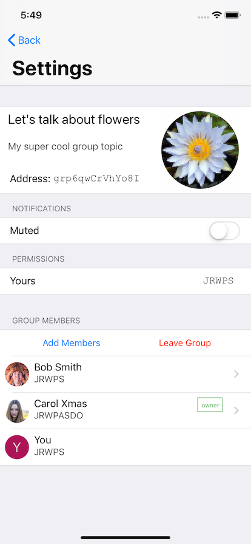

# Tinodios: Tinode Messaging Client for iOS

iOS client for [Tinode](https://github.com/tinode/chat) in Swift.

Status: work in progress.

The immediate goal is to have a basic end-to-end working application prototype that one will be able to install and use.

## Features

### Completed

* Login
* Register new accounts.
* Start new chats.
* Edit personal details.
* View the list of active chats
* Send and receive plain text messages one-on-one or in group chats.
* In-app presence notifications.
* Unread message counters.
* Local data persistence.
* Transport Level Security - https/wss.
* Drafty: Markdown-style formatting of text, e.g. \*style\* → **style**.
* Viewing attachments and inline images.
* Typing indicators.

### Does not work yet
* Edit chat parameters.
* Delivery and received/read indicators for messages (little check marks in messages).
* Muting/un-muting conversations and other permission management.
* Invite contacts to the app by SMS or email.
* Push notifications.
* Attachments and inline images cannot be created yet.

## Dependencies

### SDK

* https://github.com/tidwall/SwiftWebSocket for websocket support

### Application

* https://github.com/stephencelis/SQLite.swift for local persistence
* https://github.com/jrendel/SwiftKeychainWrapper
* [GoogleService-Info.plist](https://firebase.google.com/docs/cloud-messaging/ios/client) for push notifications. See below.

## Push notifications

If you want to use the app with your own server and want push notification to work you have to set them up:

* Register at https://firebase.google.com/, [set up the project](https://firebase.google.com/docs/ios/setup) if you have not done so already.
* [Download your own](https://firebase.google.com/docs/cloud-messaging/ios/client) config file `GoogleService-Info.plist` and place it to the `Tinodios/` folder of your copy of the project. The config file contains keys specific to your Firebase/FCM registration. The project will not compile without the `GoogleService-Info.plist`.
* Copy Google-provided server key to `tinode.conf`, see details [here](https://github.com/tinode/chat/blob/master/docs/faq.md#q-how-to-setup-fcm-push-notifications).

## Other

* Demo avatars and some other graphics are from https://www.pexels.com/ under [CC0](https://www.pexels.com/photo-license/) license.
* Some iOS icons are from https://icons8.com/ under [CC BY-ND 3.0](https://icons8.com/license) license.

## Screenshots
  
 
